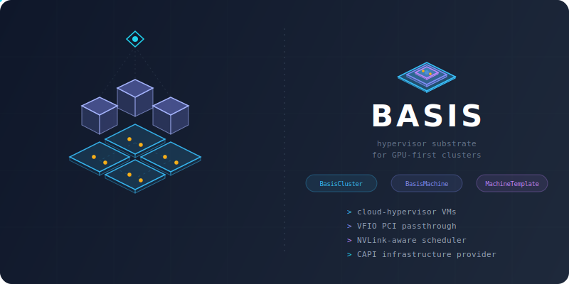

<p align="center">
  
</p>

<h3 align="center">Hypervisor substrate for GPU-first Kubernetes clusters</h3>

---

> **Sandbox project** — Basis is a hypervisor-orchestration sandbox for exploring CAPI-driven GPU Kubernetes on bare metal. It is not production-ready and is not offered as a product. Use it to learn, experiment, and prototype.

# Basis

A minimal hypervisor orchestration layer for Lattice, built on
[Cloud Hypervisor](https://github.com/cloud-hypervisor/cloud-hypervisor). Basis
exposes exactly the API surface a CAPI infrastructure provider needs — nothing
more — and is shaped around GPU workloads as first-class citizens.

## What it is (and isn't)

Basis turns a pool of bare-metal hosts into a CAPI-compatible VM substrate. It
is topology-aware at the hypervisor layer (NVLink groups, IOMMU groups, VFIO
passthrough) and deliberately narrow: a single static binary per host
(`basis-agent`), one central `basis-controller`, deployed via Ansible,
configured with YAML, secured with mTLS.

Basis is **not** a GPU cloud control plane. It does not do fractional GPUs
(HAMi handles that inside Kubernetes), multi-tenancy, metering, or a UI. It
provides just enough VM substrate for Kubernetes + Lattice to run against.

## Architecture

Three binaries, one direction of control:

- **`basis-controller`** — single process with an embedded SQLite database.
  Serves the gRPC API, schedules VMs across hosts, allocates IPs, tracks host
  health.
- **`basis-agent`** — runs on every bare-metal host. Receives commands from
  the controller over an outbound gRPC stream (no inbound firewall rules),
  supervises Cloud Hypervisor processes as systemd transient units, manages
  the disk image cache and tap devices, and binds PCI devices to `vfio-pci`
  for passthrough.
- **`basis-capi-provider`** — runs inside Kubernetes as a CAPI infrastructure
  provider. Reconciles `BasisCluster` / `BasisMachine` CRDs into gRPC calls
  against the controller.

The controller is the only external interface. Agents always connect outbound.

## Requirements

**Agent hosts**
- Linux with KVM, IOMMU enabled (`intel_iommu=on` or `amd_iommu=on`), and
  `vfio-pci` available
- `cloud-hypervisor` installed (handled by the `basis-prereqs` Ansible role)
- NVIDIA driver + `nvidia-fabricmanager` on HGX/NVL systems if using NVIDIA
  GPUs

**Controller host**
- Any Linux machine reachable from agent hosts on the configured port
  (default `:7443`)

**CAPI provider**
- A Kubernetes cluster with CAPI core controllers installed
- Network reachability to the Basis controller's gRPC endpoint

## Build

Local development:

```sh
cargo build
cargo test --workspace
```

Cross-compile for deployment (x86_64 Linux, reproducible in Docker) and deploy
in one shot:

```sh
./deploy/bootstrap.sh
```

Build the `basis-capi-provider` container image:

```sh
./scripts/build-capi-provider.sh
```

## Deploy

Copy `deploy/ansible/inventory.ini.example` to `inventory.ini`, list your
controller and agent hosts, then:

```sh
./deploy/bootstrap.sh                        # full run
./deploy/bootstrap.sh --tags agent --limit host-3
./deploy/bootstrap.sh --tags pki             # just rotate certs
```

`bootstrap.sh` cross-compiles the binaries in Docker, generates mTLS certs
under `deploy/ansible/pki/`, and installs `basis-controller` +
`basis-agent` as systemd units. Re-runs are idempotent. See
[`deploy/ansible/README.md`](./deploy/ansible/README.md) for role details.

## Repo layout

```
crates/
  basis-proto/           gRPC definitions (Basis + BasisAgent services)
  basis-common/          Shared: TLS, GPU info, time helpers, peer-CN extraction
  basis-controller/      gRPC server, scheduler, IP allocator, host health
  basis-agent/           Cloud Hypervisor supervisor, image cache, networking, VFIO
  basis-capi-provider/   CAPI reconciler (BasisCluster / BasisMachine)
deploy/
  ansible/               Playbook + roles (controller, agent, pki, prereqs)
  bootstrap.sh           End-to-end build + deploy wrapper
  crds/                  Generated CRD YAMLs
  examples/              Example manifests
  observability/         Grafana dashboards
  systemd/               Unit files installed by the playbook
scripts/                 build-capi-provider, smoke/chaos/load test helpers
Dockerfile               basis-capi-provider image
```

## Development

Full test suite, including controller/agent integration tests that exercise
the gRPC path with real TLS certs:

```sh
cargo test --workspace
```

Regenerate the CAPI provider bundle after editing
`crates/basis-capi-provider/src/crds.rs`:

```sh
scripts/generate-capi-components.sh              # refresh basis copy
scripts/generate-capi-components.sh --sync-lattice  # and update lattice's snapshot
```

`deploy/capi/infrastructure-components.yaml` is the single source of
truth — Namespace, CRDs, RBAC, Deployment in one file. A snapshot test
(`tests/components_snapshot.rs` in `basis-capi-provider`) fails in CI
if the committed file drifts from the live CRD types, so forgetting to
run the script is caught at `cargo test`.
